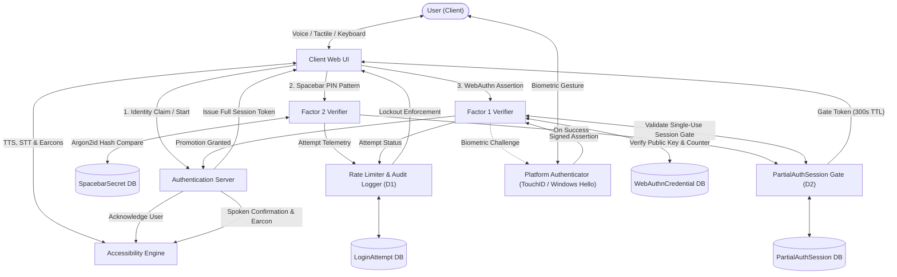

# 🛡️ TapKey — Accessible Two-Factor Authentication Protocol

[](#security-architecture)
[](#accessibility-engine)
[](#end-to-end-authentication-lifecycle)
[](#cicd-pipeline)

> **A reverse-gated, accessible Two-Factor Authentication (2FA) protocol engineered specifically for visually impaired and blind users.**
> TapKey enforces a strict sequence: a tactile spacebar secret verified with **Argon2id** creates a short-lived ephemeral session gate, followed by a hardware-backed **WebAuthn / FIDO2** biometric ceremony. The entire authentication lifecycle operates completely eyes-free using **Spoken Text-To-Speech (TTS)**, **Voice Dictation (STT)** with letter-by-letter confirmation, **Web Audio earcons**, and **ARIA live regions**.

---

## 📑 Table of Contents

- [1. System Overview](#1-system-overview)
- [2. Architectural Flow & Sequence](#2-architectural-flow--sequence)
- [3. End-to-End Authentication Lifecycle](#3-end-to-end-authentication-lifecycle)
- [4. Eyes-Free Accessibility Suite](#4-eyes-free-accessibility-suite)
- [5. Repository & Codebase Structure](#5-module-breakdown--team-responsibilities)
- [6. Security Architecture & Invariants](#6-security-architecture--invariants)
- [7. API Reference](#7-api-reference)
- [8. Installation & Quick Start](#8-installation--quick-start)
- [9. Testing & Quality Verification](#9-testing--quality-verification)

---

## 1. System Overview

Traditional multi-factor authentication systems pose insurmountable accessibility barriers for visually impaired individuals (CAPTCHAs, visual OTP codes, visual push prompts). **TapKey** eliminates visual dependencies by combining tactile keyboard interaction with hardware platform authenticators:

```
┌─────────────────────────────────────────────────────────────────────────────┐
│                              TAPKEY 2FA PROTOCOL                            │
├──────────────────────────────────────┬──────────────────────────────────────┤
│  FACTOR 2: Tactile Spacebar Secret   │  FACTOR 1: FIDO2 / WebAuthn Biometric│
│  (Evaluated FIRST)                   │  (Evaluated SECOND via Gated Token)  │
│  • Tap count / Shifted PIN cadence   │  • Platform biometric (TouchID/Hello)│
│  • Client-side high-res timing       │  • Hardware private key challenge sign│
│  • Server-side Argon2id hash check   │  • Cryptographic assertion verifier  │
└──────────────────────────────────────┴──────────────────────────────────────┘
```

### 🔒 Key Operational Invariants
1. **Reverse Order Execution**: Factor 2 (Tactile Spacebar PIN) **MUST** be solved and verified before Factor 1 (WebAuthn Biometrics) can ever be unlocked.
2. **Session Gating (Design D2)**: Factor 2 verification produces an ephemeral, single-use `PartialAuthSession` (5-minute TTL). All WebAuthn authentication endpoints reject any assertion attempt missing a valid partial auth token.
3. **Multi-Modal Accessibility**: Complete visual independence through spoken **Text-To-Speech (TTS)**, **Voice Recognition (STT)** for hands-free typing with letter-by-letter spelling verification, **Web Audio Earcons**, and standard **ARIA live-region** announcements.

---

## 2. Architectural Flow & Sequence



---

## 3. End-to-End Authentication Lifecycle

```
┌──────────┐      ┌────────────┐      ┌────────────────┐      ┌────────────┐      ┌────────────┐
│ Step 1   │ ---> │ Step 2     │ ---> │ Step 3         │ ---> │ Step 4     │ ---> │ Step 5     │
│ Claim ID │      │ Tactile F2 │      │ Session Gating │      │ WebAuthn F1│      │ Full Auth  │
└──────────┘      └────────────┘      └────────────────┘      └────────────┘      └────────────┘
```

| Step | Phase | Action & Flow Description |
| :--- | :--- | :--- |
| **01** | **Identity Claim** | User specifies username via keyboard or voice dictation. Server verifies identity existence. |
| **02** | **Factor 2 Capture** | User inputs tactile spacebar PIN pattern (digit taps confirmed with Enter/Esc). Tap rhythm is canonicalized and verified against Argon2id hash. |
| **03** | **Rate Limiting & Gating** | Security engine records attempt to `LoginAttempt`. Upon success, generates a 5-minute single-use `PartialAuthSession`. |
| **04** | **Factor 1 Gate Check** | Server validates `PartialAuthSession` token validity before issuing WebAuthn biometric challenge options. |
| **05** | **Biometric Ceremony** | Platform authenticator prompts user for fingerprint / Face / Passkey biometric gesture. |
| **06** | **Cryptographic Verification** | WebAuthn response is cryptographically validated, signature checked, and `sign_count` updated. |
| **07** | **Full Session Promotion** | `PartialAuthSession` is consumed and promoted to an active `FullSession` cookie/token. User enters the dashboard. |

---

## 4. Eyes-Free Accessibility Suite

1. **Text-To-Speech (TTS) Engine**:
   - Uses native `window.speechSynthesis` with speech queue priority handling.
   - Speaks state changes, field focus, digit tap counts, error notices, and confirmation prompts.
2. **Voice Input (STT) & Spoken Confirmation**:
   - Uses native `webkitSpeechRecognition` / `SpeechRecognition`.
   - Supports voice dictation for username and display name.
   - Spells out recognized text character-by-character (e.g. *"Y - A - S - I - R - U - 2 - 0 - 0 - 3"*) to confirm exact transcription before submitting.
3. **Web Audio Earcon Synthesizer**:
   - Sub-second synthetic multi-tone audio feedback for key taps (440Hz), digit locks (880Hz), factor success (harmonic chords), and error alerts (low frequency dissonance).
4. **ARIA Live Regions**:
   - Dual polite (`#aria-live-polite`) and assertive (`#aria-live-assertive`) screen reader regions ensuring total compatibility with NVDA, JAWS, VoiceOver, and TalkBack.

---

## 5. Repository & Codebase Structure

```bash
TapKey/
├── server/                      # 🌐 Unified Server & Frontend Application
│   ├── src/
│   │   ├── server.ts            # REST API, static server & session lifecycle orchestrator
│   │   ├── db.ts                # SQLite database interface & schema definitions
│   │   └── sessionManager.ts    # Ephemeral partial & full session management
│   └── public/
│       ├── index.html           # Accessible single-page web interface
│       ├── app.js               # Frontend state controller, TTS, STT & earcons
│       └── style.css            # Responsive dark-mode glassmorphism design system
├── factor1-webauthn/            # 🔐 Factor 1 (WebAuthn / FIDO2 Authentication)
│   ├── src/
│   │   ├── ceremony.ts          # navigator.credentials WebAuthn client triggers
│   │   ├── verifier.ts          # WebAuthn assertion verifier & sign_count checks
│   │   └── sessionGate.ts       # D2 Session Gate verification hook
│   └── tests/
├── factor2-spacebar/            # ⌨️ Factor 2 (Tactile Spacebar Authentication)
│   ├── src/
│   │   ├── capture.ts           # captureTapPattern() - timing capture & rhythm analysis
│   │   ├── hasher.ts            # Argon2id password/pattern hashing & verification
│   │   └── models.ts            # SpacebarSecret data definitions
│   └── tests/
├── accessibility-engine/        # 🔊 Eyes-Free & ARIA Accessibility Engine
│   ├── src/
│   │   ├── liveRegion.js        # ARIA Live Region announcements manager
│   │   ├── earconPlayer.js      # Web Audio earcon synthesized sound cues
│   │   └── keyHandler.js        # Keyboard event orchestration (Space/Enter/Esc)
│   └── tests/
├── security/                    # 🛡️ Security Hardening & Rate Limiting
│   ├── src/
│   │   ├── rateLimiter.ts       # D1 Rate limiter & exponential backoff engine
│   │   ├── auditLogger.ts       # Unified LoginAttempt audit logging
│   │   ├── recovery.ts          # D6 Out-of-band identity recovery protocol
│   │   └── hygiene.ts           # D7 CSRF, token hygiene, and HTTPS enforcement
│   └── tests/
└── docs/                        # 📚 Technical Specifications & Architecture Docs
    ├── architecture.md
    └── threat-model.md
```

---

## 6. Security Architecture & Invariants

* **D1 — Adaptive Rate Limiting**: Enforces progressive exponential backoff locks per username and IP upon repeated Factor 2 or Factor 1 failures.
* **D2 — Reverse-Gated Enforcement**: WebAuthn options and assertion verification strictly require an unexpired, unconsumed `PartialAuthSession` token generated by Factor 2.
* **D6 — Out-of-Band Account Recovery**: Single-use cryptographically signed recovery tokens bypass compromised sessions and enforce clean re-enrollment of both factors.
* **D7 — Strict Transport & Session Hygiene**: HTTPS-ready architecture, SameSite=Strict cookies, automatic token revocation on logout, and memory-safe secret cleanup.

---

## 7. API Reference

### Registration
* `POST /api/register/start` — Claims username and initiates registration.
* `POST /api/register/factor2` — Hashes spacebar PIN via Argon2id and stores credential.
* `POST /api/register/webauthn/options` — Generates WebAuthn credential creation challenge.
* `POST /api/register/webauthn/verify` — Verifies attestation and completes user enrollment.

### Reverse-Gated Login
* `POST /api/login/start` — Verifies username and evaluates D1 rate limit status.
* `POST /api/login/factor2` — Verifies spacebar PIN; issues 5-minute `PartialAuthSession` token on success.
* `POST /api/login/webauthn/options` — Validates `PartialAuthSession` token and generates assertion challenge.
* `POST /api/login/webauthn/verify` — Verifies biometric assertion signature; promotes session to `FullSession`.

### Session & Telemetry
* `GET /api/me` — Returns authenticated user profile and enrolled credentials.
* `POST /api/logout` — Destroys current session and revokes authentication state.
* `GET /api/logs` — Retrieves recent `LoginAttempt` security telemetry entries.

---

## 8. Installation & Quick Start

### Prerequisites
* **Node.js**: v18.0.0 or higher
* **Platform Authenticator**: WebAuthn/FIDO2 compatible device (Touch ID, Windows Hello, or Android/iOS Passkey)

### Setup & Run

1. **Clone the Repository**:
   ```bash
   git clone https://github.com/yasiru2003/TapKey.git
   cd TapKey
   ```

2. **Install Dependencies**:
   ```bash
   npm install --prefix factor2-spacebar
   npm install --prefix factor1-webauthn
   npm install --prefix security
   npm install --prefix server
   ```

3. **Start the Unified Server**:
   ```bash
   npm start --prefix server
   ```

4. **Access the Web Interface**:
   Open **`http://localhost:8095`** in your browser.

---

## 9. Testing & Quality Verification

Run the comprehensive unit and integration test suites across all modules:

```bash
# Run Factor 2 Spacebar Tests (32 tests)
npm test --prefix factor2-spacebar

# Run Factor 1 WebAuthn Tests (10 tests)
npm test --prefix factor1-webauthn

# Run Security & Rate Limiting Tests (17 tests)
npm test --prefix security

# Run Server & Session Orchestrator Tests (5 tests)
npm test --prefix server

# Run All Tests Concurrently
npm test --prefix factor2-spacebar && npm test --prefix factor1-webauthn && npm test --prefix security && npm test --prefix server
```

---

*Developed for CS3042 Computer Security.*
