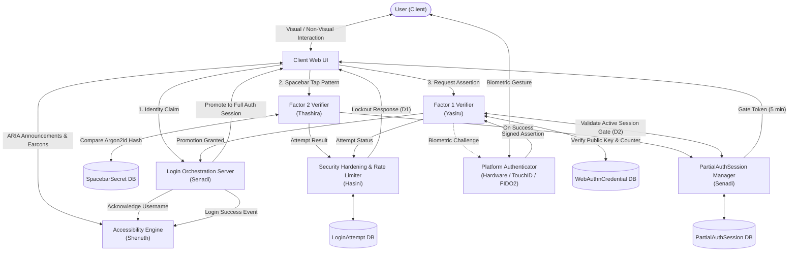
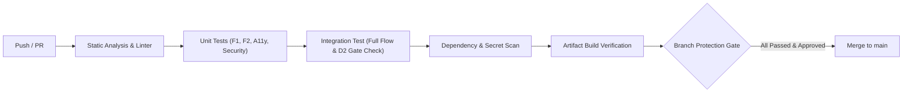

# 🛡️ TapKey — Accessible Two-Factor Authentication Protocol

[](#security-architecture)
[](#accessibility-engine)
[](#end-to-end-authentication-lifecycle)
[](#cicd-pipeline)

> **A reverse-gated, accessible Two-Factor Authentication (2FA) protocol engineered specifically for visually impaired users.**
> TapKey enforces a strict sequence: a tactile spacebar secret verified with **Argon2id** creates a short-lived session gate, followed by a hardware-backed **WebAuthn / FIDO2** biometric ceremony. The entire experience operates seamlessly eyes-free using ARIA live regions and audio earcons.

---

## 📑 Table of Contents

- [1. System Overview](#1-system-overview)
- [2. Architectural Flow & Sequence](#2-architectural-flow--sequence)
- [3. End-to-End Authentication Lifecycle](#3-end-to-end-authentication-lifecycle)
- [4. Repository & Codebase Structure](#4-repository--codebase-structure)
- [5. Module Breakdown & Team Responsibilities](#5-module-breakdown--team-responsibilities)
- [6. Cross-Module Integration Seams](#6-cross-module-integration-seams)
- [7. Security Architecture & Invariants](#7-security-architecture--invariants)
- [8. CI/CD Pipeline & Quality Gates](#8-cicd-pipeline--quality-gates)

---

## 1. System Overview

Traditional multi-factor authentication systems pose major usability barriers for visually impaired individuals (CAPTCHAs, visual OTPs, visual push notifications). **TapKey** solves this by uniting non-visual tactile inputs with hardware security authenticators:

```
┌─────────────────────────────────────────────────────────────────────────────┐
│                              TAPKEY 2FA PROTOCOL                            │
├──────────────────────────────────────┬──────────────────────────────────────┤
│  FACTOR 2: Tactile Spacebar Secret   │  FACTOR 1: FIDO2 / WebAuthn Biometric│
│  (Evaluated FIRST)                   │  (Evaluated SECOND via Gated Token)  │
│  • Tap count or cadence rhythm       │  • Platform biometric (TouchID/Hello)│
│  • Client-side high-res timing       │  • Hardware private key challenge sign│
│  • Server-side Argon2id hash check   │  • Cryptographic assertion verifier  │
└──────────────────────────────────────┴──────────────────────────────────────┘
```

### 🔒 Key Operational Principles
1. **Fixed Order Execution**: Factor 2 (Tactile) **MUST** succeed before Factor 1 (Biometric) is ever reachable.
2. **Session Gating**: Factor 2 success generates a **5-minute ephemeral `PartialAuthSession`**. Factor 1 endpoints reject any assertion attempt missing a valid, active partial session.
3. **Inclusive Eyes-Free Feedback**: State changes communicate through standard screen readers via **ARIA live regions**, supplemented by subtle earcon sound cues for sub-second tactile confirmation.

---

## 2. Architectural Flow & Sequence

### 🗺️ Connection Architecture



---

## 3. End-to-End Authentication Lifecycle

The protocol executes strictly through the following sequential stages:

```
┌───────┐      ┌───────────┐      ┌───────────────┐      ┌───────────┐      ┌────────┐
│Step 1 │ ---> │Steps 2-3  │ ---> │Step 4         │ ---> │Steps 5-7  │ ---> │Step 8  │
│Claim  │      │Tactile F2 │      │Session Gating │      │WebAuthn F1│      │FullAuth│
└───────┘      └───────────┘      └───────────────┘      └───────────┘      └────────┘
```

| Step | Phase | Action & Flow Description | Module Owner |
| :--- | :--- | :--- | :--- |
| **01** | **Identity Claim** | User inputs username. Server acknowledges receipt. The Accessibility Engine speaks confirmation via ARIA live region (no synthetic custom TTS). | **Senadi** (Server)<br/>**Sheneth** (A11y) |
| **02** | **Factor 2 Capture** | User inputs spacebar pattern (count or rhythm). `captureTapPattern()` collects millisecond timestamps and sends payload to `verifyPattern()`. | **Thashira** (F2) |
| **03** | **Rate Limiting & Log** | Every attempt is logged in `LoginAttempt`. The rate limiter enforces exponential backoff (Design **D1**). On lockout, execution terminates immediately. | **Hasini** (Security) |
| **04** | **Session Gate Creation** | Upon valid Argon2id hash verification, an ephemeral `PartialAuthSession` row is created (TTL: 300s). Handoff occurs from F2 logic to Session orchestrator. | **Senadi** (Session)<br/>**Thashira** (F2) |
| **05** | **Factor 1 Gate Check** | Client invokes `registerCredential()` / `verifyAssertion()`. Endpoint validates unexpired `PartialAuthSession` before proceeding (Design **D2**). | **Yasiru** (F1)<br/>**Senadi** (Session) |
| **06** | **Biometric Ceremony** | OS-level Platform Authenticator prompts user for local biometric action (e.g. fingerprint / Touch ID). ARIA coordinates lifecycle transitions. | **Hardware / OS**<br/>**Sheneth** (A11y) |
| **07** | **Signature Verification** | Signed assertion cryptographically verified using stored public key & anti-replay `sign_count`. Result logged to `LoginAttempt`. | **Yasiru** (F1)<br/>**Hasini** (Security) |
| **08** | **Session Established** | `PartialAuthSession` promoted to full authenticated session. Success broadcast to UI and announced via earcon + ARIA. | **Senadi** (Server)<br/>**Sheneth** (A11y) |
| **09** | **Out-of-Band Recovery** | *(Standalone Flow)* In case of lost F1 tokens, an out-of-band email flow executes (Design **D6**). Forces full re-enrollment without touching active sessions. | **Hasini** (Security) |

---

## 4. Repository & Codebase Structure

```bash
TapKey/
├── .github/
│   └── workflows/
│       └── ci.yml               # Automated CI/CD pipeline (Linter, Tests, Security scans)
├── factor1-webauthn/            # 🔐 Factor 1 (WebAuthn / FIDO2)
│   ├── src/
│   │   ├── ceremony.ts          # navigator.credentials.create() / get() client triggers
│   │   ├── verifier.ts          # WebAuthn assertion verification & sign_count check
│   │   └── sessionGate.ts       # D2 Session Gate verification hook
│   └── tests/
├── factor2-spacebar/            # ⌨️ Factor 2 (Tactile Spacebar Authentication)
│   ├── src/
│   │   ├── capture.ts           # captureTapPattern() - timing capture & rhythm analysis
│   │   ├── hasher.ts            # Argon2id hashing & verification
│   │   └── models.ts            # SpacebarSecret data definitions
│   └── tests/
├── accessibility-engine/        # 🔊 Eyes-Free & ARIA Accessibility Engine
│   ├── src/
│   │   ├── liveRegion.ts        # ARIA Live Region announcements manager
│   │   ├── earconPlayer.ts      # Web Audio earcon synthesized sound cues
│   │   └── keyHandler.ts        # Pure keyboard event orchestration (Space/Enter/Esc)
│   └── tests/
├── server/                      # 🌐 Core Orchestration & Session Management
│   ├── src/
│   │   ├── orchestrator.ts      # F2 -> Session Gate -> F1 -> Auth pipeline
│   │   ├── sessionManager.ts    # PartialAuthSession (5 min TTL) lifecycle
│   │   └── schema.prisma        # Database schema definitions
│   └── tests/
├── security/                    # 🛡️ Security Hardening & Rate Limiting
│   ├── src/
│   │   ├── rateLimiter.ts       # D1 Rate limiter & exponential backoff
│   │   ├── auditLogger.ts       # Unified LoginAttempt audit logging
│   │   ├── recovery.ts          # D6 Out-of-band recovery & re-enrollment
│   │   └── hygiene.ts           # D7 CSRF, token hygiene, and HTTPS enforcement
│   └── tests/
└── docs/                        # 📚 Architecture Specs & Developer Guides
    ├── architecture.md
    ├── threat-model.md
    └── api-contracts.md
```

---

## 5. Module Breakdown & Team Responsibilities

| Directory | Module Owner | University ID | Key Responsibilities & Deliverables |
| :--- | :--- | :--- | :--- |
| [`/factor1-webauthn/`](file:///Users/yasiru/Desktop/Academic%20/Sem%205/Computer%20Security%20/Implementation/factor1-webauthn) | **Yasiru** | `230076R` | • `registerCredential()`, `verifyAssertion()`<br/>• WebAuthn client-side API orchestration (`navigator.credentials`)<br/>• Enforcement of **D2** session gate check before ceremony<br/>• Standard library: `@simplewebauthn/server` or `py_webauthn` |
| [`/factor2-spacebar/`](file:///Users/yasiru/Desktop/Academic%20/Sem%205/Computer%20Security%20/Implementation/factor2-spacebar) | **Thashira** | `230134U` | • `captureTapPattern()`, `hashPattern()`, `verifyPattern()`<br/>• Tap-count vs. cadence-rhythm threshold algorithms<br/>• `SpacebarSecret` schema & Argon2id implementation (`argon2` / `argon2-cffi`) |
| [`/accessibility-engine/`](file:///Users/yasiru/Desktop/Academic%20/Sem%205/Computer%20Security%20/Implementation/accessibility-engine) | **Sheneth** | — | • ARIA live-region state updater for screen readers<br/>• Audio earcon synthesizer (tap feedback, status audio tones)<br/>• Keyboard navigation pipeline & headphone privacy toggle |
| [`/server/`](file:///Users/yasiru/Desktop/Academic%20/Sem%205/Computer%20Security%20/Implementation/server) | **Senadi** | — | • `PartialAuthSession` model & 5-minute expiry lifecycle<br/>• End-to-end multi-step login orchestration endpoint<br/>• Central API contract definition uniting F1 & F2 |
| [`/security/`](file:///Users/yasiru/Desktop/Academic%20/Sem%205/Computer%20Security%20/Implementation/security) | **Hasini** | `230143V` | • Central `LoginAttempt` unified audit logging<br/>• **D1** Rate limiting & exponential lockout engine<br/>• **D6** Out-of-band identity recovery protocol<br/>• **D7** HTTPS enforcement, CSRF token validation & security hygiene |
| [`/docs/`](file:///Users/yasiru/Desktop/Academic%20/Sem%205/Computer%20Security%20/Implementation/docs) | **All Team** | — | • Security proofs, integration test suites, and protocol documentation |

---

## 6. Cross-Module Integration Seams

To guarantee zero regressions and strict security enforcement, the following architectural seams require collaborative testing:

```
                  ┌──────────────────────┐
                  │ Integration Matrix   │
                  └──────────┬───────────┘
                             │
     ┌───────────────────────┼───────────────────────┐
     ▼                       ▼                       ▼
[Thashira ↔ Senadi]    [Senadi ↔ Yasiru]     [Everyone ↔ Sheneth]
F2 Success creates     Session Gate check    State changes trigger
PartialAuthSession     enforced at F1        ARIA announcements
```

| Integration Seam | Involved Modules | Critical Assertion / Invariant |
| :--- | :--- | :--- |
| **F2 Verification ➔ Session Gate** | `Thashira` ↔ `Senadi` | A successful tactile pattern match correctly generates a database-backed `PartialAuthSession` with exact 300s TTL. |
| **Session Gate ➔ F1 Endpoint** | `Senadi` ↔ `Yasiru` | Factor 1 endpoint rejects **100%** of assertion requests if session token is missing, expired, or forged (**Design Choice D2**). |
| **State Changes ➔ ARIA Live Updates** | `All Modules` ↔ `Sheneth` | Every server status response or failure triggers an instant ARIA announcement; no silent rejections. |
| **Failure Telemetry ➔ Audit Logging** | `Thashira`, `Yasiru` ↔ `Hasini` | Both Factor 2 failures and Factor 1 assertion anomalies record to `LoginAttempt` with timestamp and client fingerprint. |

---

## 7. Security Architecture & Invariants

> [!IMPORTANT]
> **Core Invariant D2 (Gated Multi-Factor Authentication):**
> An attacker with physical access to a FIDO2 platform authenticator cannot authenticate without first passing the tactile Factor 2 spacebar challenge.

* **D1 — Adaptive Rate Limiting**: Exponential backoff triggered per username and source IP upon consecutive Factor 2 failures.
* **D2 — Reverse-Gated Enforcement**: No WebAuthn challenge generation or assertion processing without a validated `PartialAuthSession`.
* **D6 — Isolated Out-of-Band Recovery**: Recovery relies on cryptographically signed email magic tokens. Recovery bypasses existing sessions and forces full re-enrollment of both factors.
* **D7 — Strict Transport & Session Hygiene**: HTTPS-only transport, SameSite=Strict secure cookies, CSRF protection on state-changing endpoints, and memory-safe cryptographic token destruction.

---

## 8. CI/CD Pipeline & Quality Gates

The repository is protected by automated GitHub Actions CI/CD workflows executing on all Pull Requests and pushes to `main`:



- **Code Quality**: ESLint / Prettier code style and syntax checks.
- **Isolated Unit Testing**: Independent test suites for WebAuthn crypto, Argon2id hashing, and rate limiting logic.
- **Protocol Integration Tests**: Automated verification of the end-to-end 8-step authentication pipeline and D2 gate bypass prevention.
- **Security Scans**: `npm audit` / `bandit` vulnerability scans + GitGuardian secret detection.
- **Branch Protection**: Direct pushes to `main` are blocked; requires green CI status and peer review approval.

---

*Developed as part of the CS3042 / Computer Security Implementation Module.*
