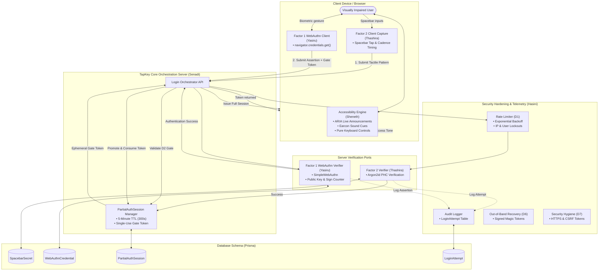

# 🏛️ TapKey System Architecture Specification

## 1. Executive Summary

**TapKey** is an accessible Two-Factor Authentication (2FA) protocol engineered specifically for visually impaired users. Unlike conventional MFA systems that present visual OTPs or CAPTCHAs, TapKey combines:
1. **Factor 2 (Tactile Spacebar Secret)** evaluated *first* to establish an ephemeral session gate.
2. **Factor 1 (Hardware-backed FIDO2 / WebAuthn Biometric)** evaluated *second* only after passing through the session gate.
3. **Continuous Eyes-Free Accessibility** powered by ARIA live regions and non-visual synthesized audio earcons.

---

## 2. End-to-End System Architecture



---

## 3. Protocol Lifecycle & State Transitions

```
[ UNINITIALIZED ]
       │
       ▼ (Identity Claim: POST /api/login/start)
[ FACTOR_2_PENDING ]
       │
       ├─► (Failure / Lockout) ──► [ LOCKED_OUT ] ──► (D1 Backoff / D6 Recovery)
       │
       ▼ (Valid Argon2id Match: POST /api/login/factor-2)
[ PARTIAL_AUTH_GATE_ACTIVE ] (TTL: 300s, Stored in DB as SHA-256 Hash)
       │
       ├─► (TTL Expires / Invalid Token) ──► [ REJECTED (D2 Violation) ]
       │
       ▼ (Valid Assertion: POST /api/login/factor-1)
[ FULLY_AUTHENTICATED ]
```

### Step-by-Step Sequence
1. **Identity Claim**: User provides identifier; server validates account existence and returns `FACTOR_2` state.
2. **Tactile Spacebar Capture**: High-resolution event listeners capture spacebar presses and timings without echoing raw keys to screen readers.
3. **Security Gate & Rate Limiting**: Request passes through Hasini's rate limiter. Lockouts trigger exponential delay.
4. **Argon2id Verification**: Canonicalized pattern (`SB1|COUNT`, `SB1|RHYTHM`, or `SB2|PIN`) is verified with memory-hard Argon2id.
5. **Partial Session Issuance**: Upon match, an ephemeral `PartialAuthSession` token is generated with a strict 300s TTL.
6. **WebAuthn Ceremony**: Client initiates `navigator.credentials.get()` using the Relying Party challenge.
7. **D2 Invariant Enforcement**: WebAuthn endpoint verifies that the caller holds an active, unexpired `PartialAuthSession`.
8. **Assertion Verification & Promotion**: Cryptographic signature and `sign_count` are validated; the partial session is consumed and full session cookies are issued.

---

## 4. Module Contracts and Responsibilities

| Module | Component | Owner | Responsibilities |
| :--- | :--- | :--- | :--- |
| `factor1-webauthn` | WebAuthn FIDO2 Engine | Yasiru (`230076R`) | Credential registration, cryptographic assertion verification, `sign_count` replay detection, and D2 session gate hook enforcement. |
| `factor2-spacebar` | Tactile Spacebar Secret | Thashira (`230134U`) | Tactile spacebar capture, shifted PIN, count group, and cadence rhythm thresholding, Argon2id hashing & verification. |
| `accessibility-engine` | Accessibility & Earcons | Sheneth | Eyes-free navigation, ARIA live region status broadcasting, private audio earcons synthesizer. |
| `server` | Orchestration & Sessions | Senadi | Central authentication pipeline, 5-minute ephemeral `PartialAuthSession` lifecycle, Prisma schemas. |
| `security` | Security & Hardening | Hasini (`230143V`) | D1 exponential backoff rate limiter, `LoginAttempt` unified audit logging, D6 out-of-band recovery, D7 transport and CSRF hygiene. |

---

## 5. Security Invariants

* **Invariant D1 (Adaptive Lockout)**: Exponential backoff triggered per username and IP upon consecutive Factor 2 failures.
* **Invariant D2 (Reverse-Gated Multi-Factor)**: WebAuthn verification endpoint categorically rejects 100% of assertion requests lacking a valid, active partial session.
* **Invariant D6 (Isolated Out-of-Band Recovery)**: Account recovery bypasses existing session gates and enforces total factor re-enrollment.
* **Invariant D7 (Strict Hygiene)**: HTTPS-only transport, SameSite=Strict cookies, anti-CSRF token verification, and memory-safe secret cleanup.
