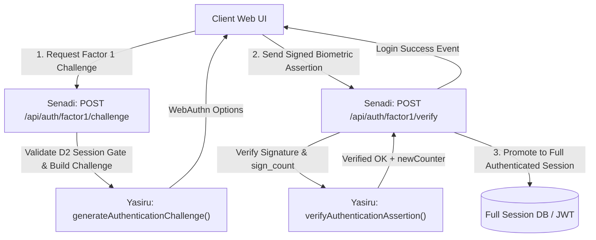

# 🔐 Factor 1 — WebAuthn / FIDO2 Authentication Module

> **Owner**: Yasiru (`230076R`)  
> **Package**: `@tapkey/factor1-webauthn`  
> **Security Protocol**: TapKey Accessible 2FA Protocol

---

## 📖 Module Summary

The **Factor 1** module provides hardware-backed FIDO2 / WebAuthn biometric authentication (Touch ID, Windows Hello, Face ID, Apple Passkeys) with **strict enforcement of Design Choice D2**.

### 🔒 Invariants & Security Guarantees
1. **Design Choice D2 Enforcement**: Rejects 100% of Factor 1 requests (challenge generation or assertion verification) if the client does not hold an active, unexpired `PartialAuthSession` from Factor 2.
2. **Anti-Replay Counter Tracking**: Validates and tracks `sign_count` progression on stored credentials to detect cloned authenticators or replay attacks.
3. **Audit Logging Integration**: Emits structured telemetry (`SUCCESS`, `FAILURE`, `BLOCKED_SESSION_GATE`) to Hasini's `LoginAttempt` logging engine.

---

## 🏗️ Architectural Flow for Login Orchestration



---

## 📦 API Surface & Exports

```typescript
import {
  // Server-side Ceremonies
  generateRegistrationChallenge,
  verifyRegistrationResponse,
  generateAuthenticationChallenge,
  verifyAuthenticationAssertion,
  assertSessionGateActive,

  // Client-side Browser Wrappers
  checkBrowserWebAuthnSupport,
  checkPlatformAuthenticatorAvailable,
  performClientRegistrationCeremony,
  performClientAuthenticationCeremony,

  // Types & Errors
  type StoredWebAuthnCredential,
  type WebAuthnUser,
  type SessionGateValidator,
  type AuditLogger,
  type WebAuthnServerConfig,
  SessionGateError,
  WebAuthnVerificationError,
} from '@tapkey/factor1-webauthn';
```

---

## 🛠️ Step-by-Step Server Integration Guide (For Senadi)

### 1. Implement the `SessionGateValidator` (D2 Enforcement)
Senadi connects his `PartialAuthSession` database table to Yasiru's D2 gate validator:

```typescript
import type { SessionGateValidator } from '@tapkey/factor1-webauthn';

export const sessionGateValidator: SessionGateValidator = {
  async validatePartialSession(sessionToken: string, userId: string) {
    const session = await prisma.partialAuthSession.findUnique({
      where: { token: sessionToken },
    });

    if (!session || session.userId !== userId) {
      return { isValid: false, reason: 'SESSION_NOT_FOUND' };
    }

    // Enforce 5-minute expiry (TTL <= 300s)
    if (session.expiresAt < new Date()) {
      return { isValid: false, reason: 'SESSION_EXPIRED' };
    }

    return { isValid: true, userId, expiresAt: session.expiresAt };
  },
};
```

---

### 2. Implement the `AuditLogger` (For Hasini's Module)
Connects to the `LoginAttempt` table:

```typescript
import type { AuditLogger, AuditLogEntry } from '@tapkey/factor1-webauthn';

export const auditLogger: AuditLogger = {
  async logAttempt(entry: AuditLogEntry) {
    await prisma.loginAttempt.create({
      data: {
        userId: entry.userId,
        factor: entry.factor,
        ceremony: entry.ceremony,
        outcome: entry.outcome,
        reason: entry.reason,
        signCount: entry.signCount,
        ipAddress: entry.ipAddress,
        userAgent: entry.userAgent,
        createdAt: entry.timestamp || new Date(),
      },
    });
  },
};
```

---

### 3. Expose Server Endpoints in Express / Fastify

#### Endpoint A: Issue Factor 1 Authentication Challenge
```typescript
app.post('/api/auth/factor1/challenge', async (req, res) => {
  try {
    const { userId, partialSessionToken } = req.body;

    const user = await prisma.user.findUnique({ where: { id: userId } });
    const userCredentials = await prisma.webAuthnCredential.findMany({
      where: { userId },
    });

    const options = await generateAuthenticationChallenge({
      user: { id: user.id, username: user.username },
      sessionToken: partialSessionToken,
      gateValidator: sessionGateValidator,
      userCredentials,
      config: webAuthnConfig,
      auditLogger,
    });

    // Store challenge in temporary session state for verification
    req.session.currentChallenge = options.challenge;

    return res.json(options);
  } catch (err) {
    if (err instanceof SessionGateError) {
      return res.status(403).json({ error: err.message, code: err.code });
    }
    return res.status(400).json({ error: err.message });
  }
});
```

#### Endpoint B: Verify Biometric Assertion & Promote Session
```typescript
app.post('/api/auth/factor1/verify', async (req, res) => {
  try {
    const { userId, partialSessionToken, assertionResponse } = req.body;

    const storedCredential = await prisma.webAuthnCredential.findUnique({
      where: { id: assertionResponse.id },
    });

    if (!storedCredential) {
      return res.status(404).json({ error: 'Credential not found' });
    }

    const result = await verifyAuthenticationAssertion({
      user: { id: userId, username: req.user.username },
      response: assertionResponse,
      expectedChallenge: req.session.currentChallenge,
      storedCredential,
      sessionToken: partialSessionToken,
      gateValidator: sessionGateValidator,
      config: webAuthnConfig,
      auditLogger,
    });

    // 1. Update sign counter in DB (anti-replay invariant)
    await prisma.webAuthnCredential.update({
      where: { id: storedCredential.id },
      data: { signCount: result.newCounter, lastUsedAt: new Date() },
    });

    // 2. Promote to Full Authenticated Session
    const fullSession = await createFullAuthenticatedSession(userId);

    return res.json({ success: true, session: fullSession });
  } catch (err) {
    if (err instanceof SessionGateError) {
      return res.status(403).json({ error: err.message, code: err.code });
    }
    return res.status(400).json({ error: err.message });
  }
});
```

---

## 🧪 Local Testing & Verification

### Run Automated Tests
```bash
cd factor1-webauthn
npm test
```

### Run Standalone Interactive Browser Demo
```bash
cd factor1-webauthn
npm run demo
# Access interactive dashboard at http://localhost:8085
```
